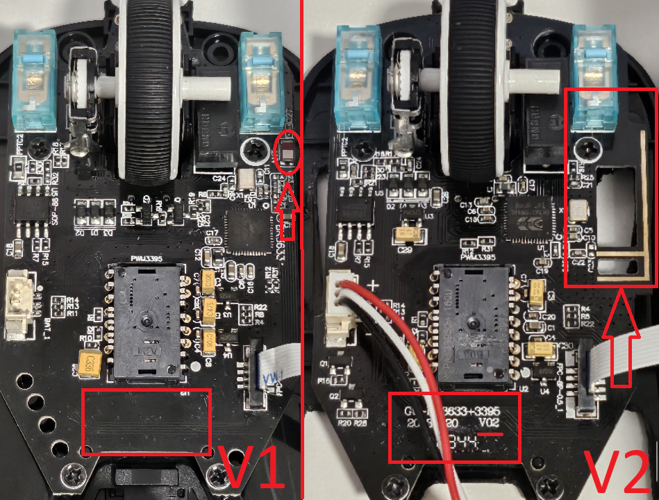

# Attack Shark x3 / Kysona M600 fixes

## Disclaimer: <u>**I have no affiliation with either Attack Shark or Kysona**</u>, I am simply someone who bought the X3 mouse and would want to share information about it.  

Hello! I've created this repo to share my knowledge about the Attack Shark X3 mouse.  
Please be aware there are risks of bricking your mouse when attempting any firmware upgrades.  
You will <u>definitely</u> brick your mouse if you apply the firmware update on your V2 or newer X3 mouse.

**Note: This repo serves as a mirror for the Kysona M600 mouse files in case the official download sources are down.**

## Table of contents

- [How to check if you have a V1 or V2 mouse](#how-to-check-if-you-have-a-v1-or-v2-mouse)
- [Firmware files usage guide](#firmware-files-usage-guide)
- [Firmware update order](#v1-only-firmware-update-order-do-not-run-these-on-v2-or-newer)
- [Mods etc](#mods-etc)
- [References](#references)

## How to check if you have a V1 or V2 mouse

If your mouse has been manufactured after September 2023, or if your mouse motherboard is the V2 board, you do not need to perform any firmware updates.  
Only install the Windows software `2._M600_Driver_V1.1.zip` and set your Key Response Time to 4MS, and you are done!

```diff
- Your mouse can brick if you install these firmware packages onto a V2 Attack Shark x3.
```

### Instructions

Hold `caps lock`, and without updating any firmware files, it means you either have a V1 mouse with updated firmware already, or you have a V2 or newer X3 model.

Here is the motherboard difference V1 on the left, V2 on the right:  
</img>

## Firmware files usage guide

There are 4 files that come from the Kysona blog post. (See [references](#references))  
These firmware files only apply to the earlier V1 models manufactured before September 2023.

| Filename                                   | File Type        | Compatibility           | Usage                                                                                                                  |
| ------------------------------------------ | ---------------- | ----------------------- | ---------------------------------------------------------------------------------------------------------------------- |
| `1._M600_Upgrade_Tool.zip`                 | Firmware         | <u>**V1 Only**</u>      | Fixes jittery mouse sensor tracking                                                                                    |
| `2._M600_Driver_V1.1.zip`                  | Windows Software | V1, V2 and likely newer | Main mouse software which allows ajusting the mouse debounce time to as low as 4ms (lower is better)                   |
| `M600-20231013-_driver_for_receiver.zip`   | Firmware         | <u>**V1 Only**</u>      | Fixes mouse freezing when holding `caps lock` (Must be used alongside with `M600_20231013-_driver_for_M600_Mouse.zip`) |
| `M600_20231013-_driver_for_M600_Mouse.zip` | Firmware         | <u>**V1 Only**</u>      | Fixes mouse freezing when holding `caps lock` (Must be used alongside with `M600-20231013-_driver_for_receiver.zip`)   |

See which order you should run these if you have a V1 mouse

## <u>**V1 Only**</u> Firmware update order (DO NOT RUN THESE ON V2 OR NEWER!)

```diff
- WARNING! Only run these files once you know for sure your mouse is a V1 board,
- AND if you are experiencing your mouse freezing when holding caps lock!
```

Run them in this order:

1. `1._M600_Upgrade_Tool.zip`
2. `2._M600_Driver_V1.1.zip`
3. `M600-20231013-_driver_for_receiver.zip`
4. `M600_20231013-_driver_for_M600_Mouse.zip`

## Mods etc

I lowered the weight to only <u>44g</u> by cutting the bottom shell and by installing a smaller battery.  
See pictures of my modded X3 mouse in [mod_showcase](./mod_showcase/README.md).

### WARNING: Battery mod

This mouse does not have any power circuit protection.  
If you accidentally invert the positive and negative polarities, your mouse's board is done for.  
I learned about this the hard way `:(`

## References:

https://shop.kysona.com/blogs/news/upgrade-kysona-m600-drive-to-enable-debounce-time-adjustment  
https://shop.kysona.com/blogs/news/troubleshooting-bricked-kysona-m600-mice-two-essential-tools-for-recovery
