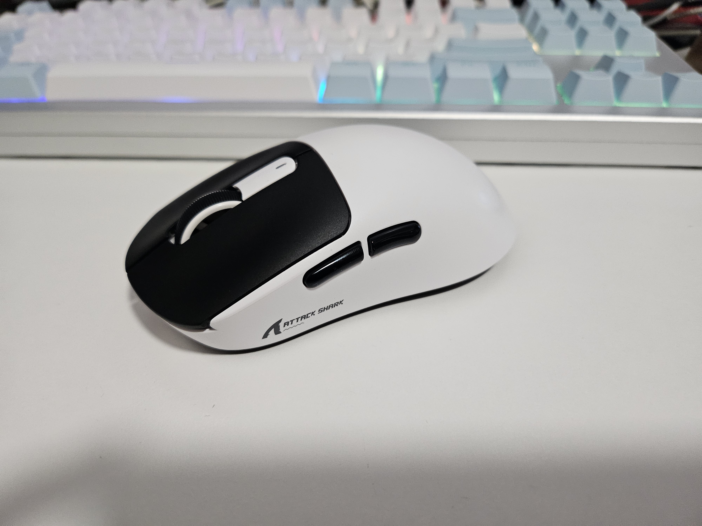
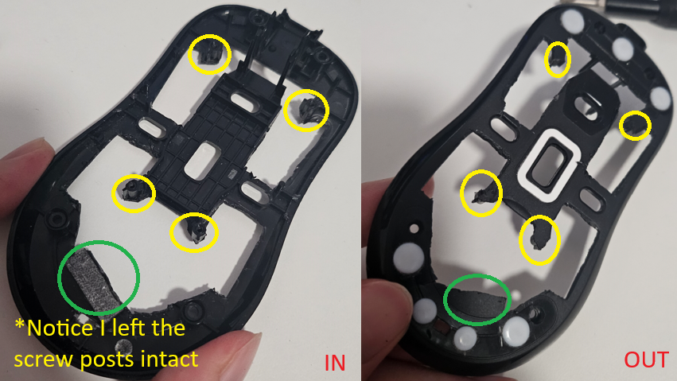
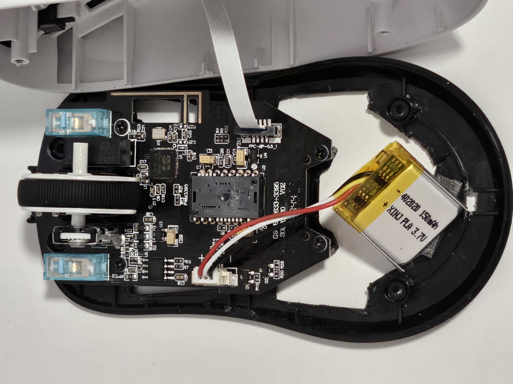

# Mod Showcase

Hi everyone, this is a showcase of my personal Attack Shark X3 modded mouse.  
After [destroying my V1 mouse](../README.md#warning-battery-mod), I now own a V2 mouse as a replacement and interchanged a few parts.  
It now weighs 44g and has a 2 tone color.

Table of contents

- [How I achieved 44g in weight](#how-i-achieved-44g-in-weight)
- [How much did all of it cost?](#how-much-did-all-of-it-cost)

Here is how it looks like:  


```bash
# Don't you think it looks like Takumi's Panda Trueno too?
# Those who know will know :)
```

## How I achieved 44g in weight

By using my wire cutters, I demolished most of the bottom shell and made it look like this:  


- The green circle represents the stock sticky foam that held the original battery.  
   I've just cut it smaller in size.
- The stock mouse skates are replaced with esptiger Ice v2 ptfe dots
- **Please be careful when handling Lithium batteries as they are dangerous. I suggest you research on battery safety before applying this mod.**  
   The battery was replaced with a 3.7V, 150mAh, 402020 size, 3pin 1.25mm jst Li-Po battery.  
   It came with the polarities inverted.  
   See [this video](https://www.youtube.com/watch?v=nRVhPhfdawg) to invert the wires around.

After these modifications, this is how the bottom housing looks like with the mobo screwed in.  


## How much did all of it cost?

Here is the cost breakdown for the costs rounded **<u>up</u>**, in USD.

- V1 mouse $29
- V2 mouse $11 (On sale with coupons and store coins)
- Battery 2pcs for $10 (Unfortunately, low capacity batteries are not sold individually)
- ESPTiger mouse skates $5

Tools:

- Wire cutters $3

Total: $58 USD including tools (And I could have theoretically ended up with 2 mice with the same mods)
